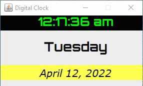

# Digital-Clock



A digital clock in a Java GUI application displays the time, day, and current date.

## To compile and run Calculator.java
```
//compile
$ javac -d . Calculator.java

//run
$ java cal.Calculator
```